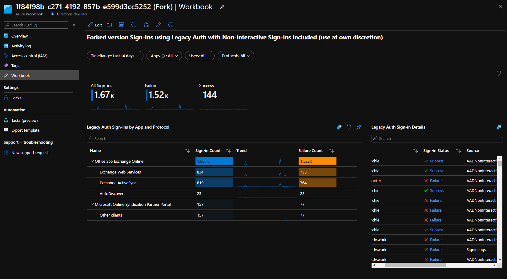
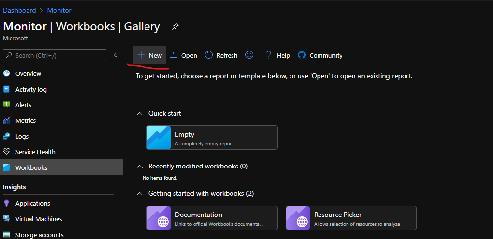
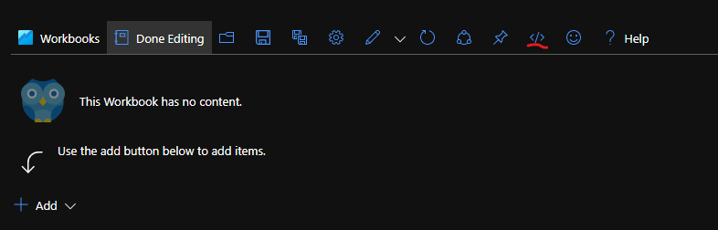
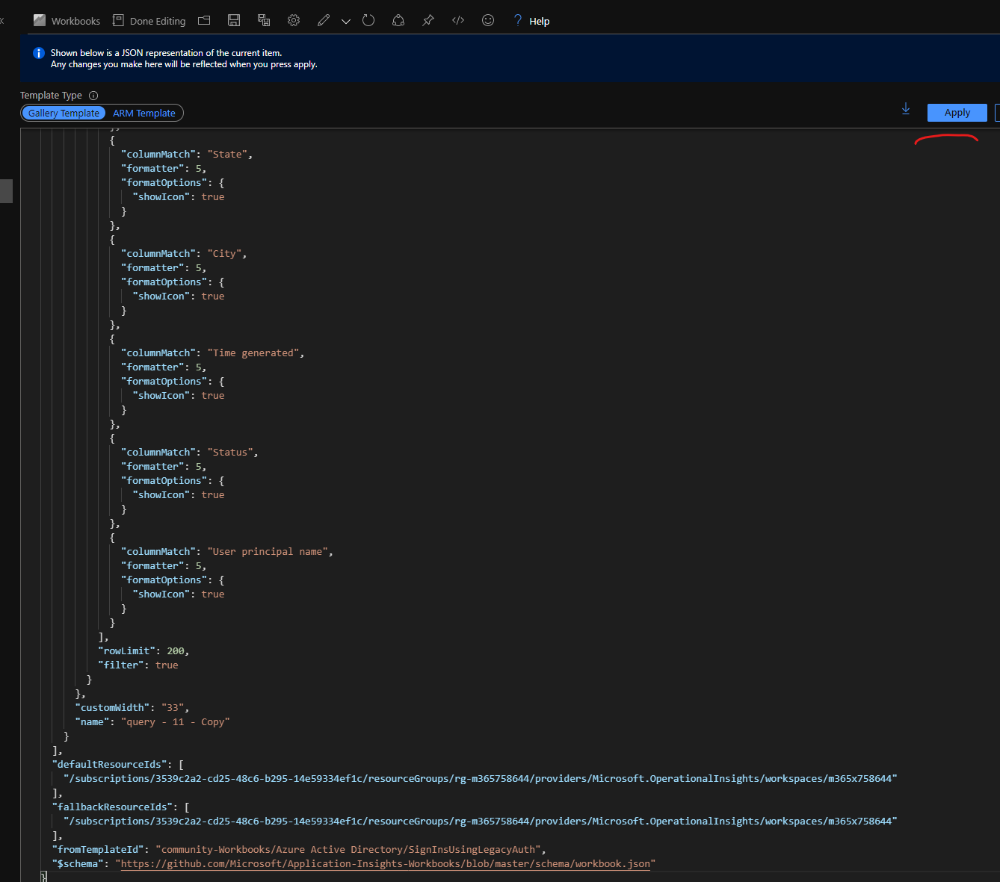
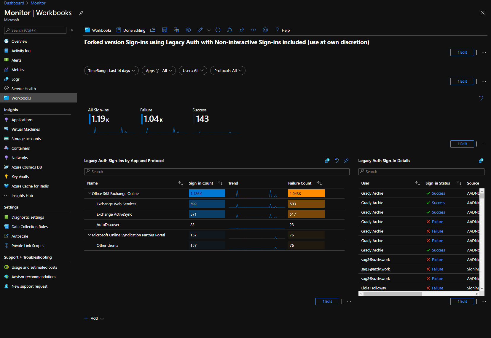

## Azure AD Workbook fork for combining interactive and non-interactive logs 
This is fork of the existing Azure AD workbook for Legacy Auth Sign-ins. This fork combines  non-interactive and sign-in logs for legacy authentication
- Compared to the original book, the 'Interuptions count' -metric is removed, if needed this metric can be added to the workbook with very little work 
- If you are interested about the combination of two log types, I wrote about that [link](https://securecloud.blog/2021/01/11/log-analytics-normalizing-different-data-types-for-analytics/)

```json
"fromTemplateId": "community-Workbooks/Azure Active Directory/SignInsUsingLegacyAuth",
    "$schema": "https://github.com/Microsoft/Application-Insights-Workbooks/blob/master/schema/workbook.json"
```
- [Azure AD Workbook fork for combining interactive and non-interactive logs](#azure-ad-workbook-fork-for-combining-interactive-and-non-interactive-logs)
- [Preview](#preview)
- [Warning](#warning)
- [Pre-requisites](#pre-requisites)
- [Deployment](#deployment)
  - [Edit the included workbook.json](#edit-the-included-workbookjson)
  - [Azure Monitor Workbooks -  create new workbook](#azure-monitor-workbooks----create-new-workbook)
  - [Azure Monitor Workbooks - select the </> code editor](#azure-monitor-workbooks---select-the--code-editor)
  - [Azure Monitor Workbooks - View the template](#azure-monitor-workbooks---view-the-template)
## Preview
Updated workbook includes new sign-in types, and displays source in "Sign in details"


## Warning
Minimal description and context provided.

Recommended reading:
https://docs.microsoft.com/en-us/azure/azure-monitor/log-query/log-query-overview
https://docs.microsoft.com/en-us/azure/active-directory/reports-monitoring/concept-all-sign-ins


## Pre-requisites
- Azure AD and Azure Subscription
- Export AADNonInteractiveUserSignInLogs & SigninLogs are exported to existing Log Analytics Workspace
  
## Deployment

### Edit the included workbook.json
- in workbook.json replace the following values with the log analytics workspaces you have exported the logs to (Starting from line 485)
```json
 "defaultResourceIds": [
      "/subscriptions/3539c2a2-cd25-48c6-b295-14e59334ef1c/resourceGroups/rg-m365758644/providers/Microsoft.OperationalInsights/workspaces/m365x758644",
    ],
    "fallbackResourceIds": [
      "/subscriptions/3539c2a2-cd25-48c6-b295-14e59334ef1c/resourceGroups/rg-m365758644/providers/Microsoft.OperationalInsights/workspaces/m365x758644",
    ],
``` 
### Azure Monitor Workbooks -  create new workbook

### Azure Monitor Workbooks - select the </> code editor

- paste contents of workbook.json to code editor, and click apply
  - "Ensure 'Gallery Template' is selected (should be default)
  

### Azure Monitor Workbooks - View the template

